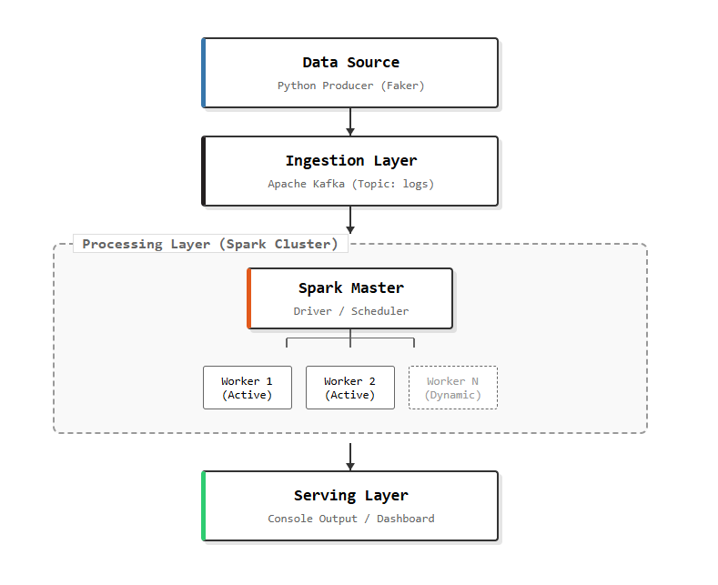

<div align="center">
    
</div>

<!-- <h1 align="center">
Autoscaling Stream ETL & Window Aggregation using Spark Structured Streaming
</h1>

<div style="text-align:center">
    
    
    
    
    
    
    
</div>

<br/>
 -->


--- 

## Project Overview

This project demonstrates a **Cloud-Native Autoscaling Data Pipeline**. It simulates a real-time stream of Computer Science student activity logs, processes them using **Apache Spark Structured Streaming**, and dynamically scales computing resources based on traffic load.

### Key Features

1.  **Real-Time ETL:** Ingests raw logs from Kafka, parses JSON, and filters data.
2.  **Window Aggregation:** Calculates "Total Lines of Code" and "Average CPU Usage" over sliding 10-second windows.
3.  **Dynamic Autoscaling:** The cluster automatically scales from **0 to 4 Executors** based on incoming load (Backlog).
4.  **Resource Optimization:** configured to prevent resource hoarding (limits executors to 2 cores each).

---

## Architecture

<div>
    
</div>

---

## Project Demo
<div align="center">
    <a href="https://drive.google.com/file/d/16rk1fZsm3CFEdXcpfkzRPgar77e3Q5Oe/view?usp=sharing">
        
    </a>
</div>
---


## Prerequisites (Windows Environment)

To run this project locally, ensure you have the following installed:

1.  **Docker Desktop** (For running Apache Kafka).
2.  **Apache Spark** (Version 4.0.1 or 3.5.x).
3.  **Python 3.x** (with `pyspark`, `kafka-python`, `faker` installed).
4.  **Java JDK** (Version 17 or 11).
5.  **CRITICAL:** `hadoop.dll` must be present in your `C:\Windows\System32` folder or your Hadoop bin folder to fix Windows file permission errors.

---

## Execution Guide (Step-by-Step)

Follow these steps in **PowerShell** to replicate the autoscaling demo.

### 1. Start the Messaging Queue (Kafka)

Start the Docker container for Kafka.

```powershell
docker-compose up -d
```

### 2\. Start the Spark Master

Open a **new terminal** and launch the Master node.

```powershell
spark-class org.apache.spark.deploy.master.Master
```

-   **Note:** Copy the Master URL from the logs (e.g., `spark://192.168.100.110:7077`).
-   **UI:** Access the dashboard at `http://localhost:8081`.

### 3\. Start the Spark Worker

Open a **new terminal** and connect a worker to the Master.

```powershell
# Replace with YOUR Master IP found in Step 2
spark-class org.apache.spark.deploy.worker.Worker spark://192.168.100.110:7077
```

### 4\. Start the Data Producer

Open a **new terminal**. This script generates student log data.

```powershell
python producer.py
```

### 5\. Submit the Streaming Job (The Brain)

Open a **new terminal**. Run this exact command.
_Note: We use `--executor-cores 2` to ensure one executor doesn't hog all CPU cores, allowing room for autoscaling._

```powershell
spark-submit --master spark://192.168.100.110:7077 --executor-cores 2 --packages org.apache.spark:spark-sql-kafka-0-10_2.13:4.0.1 --conf spark.dynamicAllocation.enabled=true --conf spark.dynamicAllocation.minExecutors=0 --conf spark.dynamicAllocation.maxExecutors=4 --conf spark.dynamicAllocation.executorIdleTimeout=10s --conf spark.dynamicAllocation.schedulerBacklogTimeout=1s stream_job.py
```

---

## How to Demo Autoscaling

Once the system is running, follow these steps to demonstrate elasticity:

1.  **Verify Baseline:**

    -   Go to `http://localhost:8081` (Master UI).
    -   Look at **Running Applications** -\> Click your App ID -\> Click **Executors** tab.
    -   You should see **1 Active Executor**.

2.  **Create a Traffic Spike:**

    -   Open **3 or 4 NEW PowerShell terminals**.
    -   Run `python producer.py` in ALL of them simultaneously.

3.  **Observe Scaling:**

    -   Refresh the **Executors** tab in your browser.
    -   Spark will detect the backlog and automatically launch **Executor 2, 3, and 4**.
    -   _Why?_ The system realizes 1 worker is not enough to process the flood of data.

4.  **Cooldown:**

    -   Close the extra producer terminals.
    -   Wait \~15 seconds.
    -   Refresh the UI. The extra executors will be killed to save resources (Scaling In).

---

<div align="">
  <h3>📄 Full Project Report</h3>
  <p>For a deep dive into the theoretical concepts, cost analysis, and implementation details, please view the academic report.</p>
  <a href="./assets/Project-Report.pdf">
    
  </a>
</div>