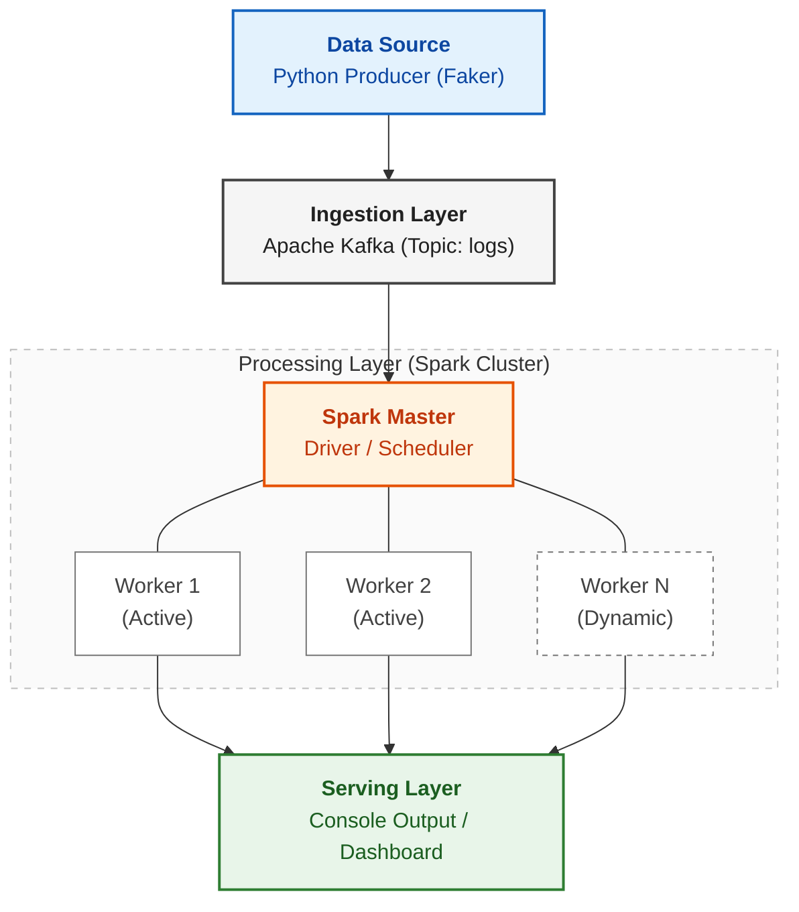

<div align="center">
    
</div>

<!-- <h1 align="center">
Autoscaling Stream ETL & Window Aggregation using Spark Structured Streaming
</h1>

<div style="text-align:center">
    
    
    
    
    
    
    
</div>

<br/>
 -->


--- 

## Project Overview

This project demonstrates a **Cloud-Native Autoscaling Data Pipeline**. It simulates a real-time stream of Computer Science student activity logs, processes them using **Apache Spark Structured Streaming**, and dynamically scales computing resources based on traffic load.

### Key Features

1.  **Real-Time ETL:** Ingests raw logs from Kafka, parses JSON, and filters data.
2.  **Window Aggregation:** Calculates "Total Lines of Code" and "Average CPU Usage" over sliding 10-second windows.
3.  **Dynamic Autoscaling:** The cluster automatically scales from **0 to 4 Executors** based on incoming load (Backlog).
4.  **Resource Optimization:** configured to prevent resource hoarding (limits executors to 2 cores each).

---

## Architecture



<!-- <div>
    
</div> -->

---

## Project Demo
<div align="center">
    <a href="https://drive.google.com/file/d/16rk1fZsm3CFEdXcpfkzRPgar77e3Q5Oe/view?usp=sharing">
        
    </a>
</div>
---


## Prerequisites (Windows Environment)

To run this project locally, ensure you have the following installed:

1.  **Docker Desktop** (For running Apache Kafka).
2.  **Apache Spark** (Version 4.0.1 or 3.5.x).
3.  **Python 3.14+** (with `uv` package manager for dependency management).
4.  **Java JDK** (Version 17 or 11).
5.  **CRITICAL:** `hadoop.dll` must be present in your `C:\Windows\System32` folder or your Hadoop bin folder to fix Windows file permission errors.
6.  **uv** (Fast Python package manager) - [Install uv](https://docs.astral.sh/uv/getting-started/)

### Install Project Dependencies with uv

This project uses `uv` for fast, reliable dependency management. After cloning the repository:

```powershell
# Activate the virtual environment
.venv\Scripts\Activate.ps1

# Or install all dependencies at once
uv sync
```

The project dependencies are defined in `pyproject.toml`:
- **pyspark** (4.1.1+) - Apache Spark for distributed stream processing
- **kafka-python** (2.3.0+) - Kafka client for message publishing
- **faker** (40.1.2+) - Fake data generation for testing

---

## Getting Started

Ready to run the project? Follow the comprehensive step-by-step guide in [**GETTING_STARTED.md**](GETTING_STARTED.md) which includes:

- Detailed setup instructions
- 5-terminal execution walkthrough
- How to demonstrate autoscaling in action
- Troubleshooting tips
- System shutdown procedures

---

<div align="">
  <h3>📄 Full Project Report</h3>
  <p>For a deep dive into the theoretical concepts, cost analysis, and implementation details, please view the academic report.</p>
  <a href="./assets/Final Project Report.pdf">
    
  </a>
</div>
